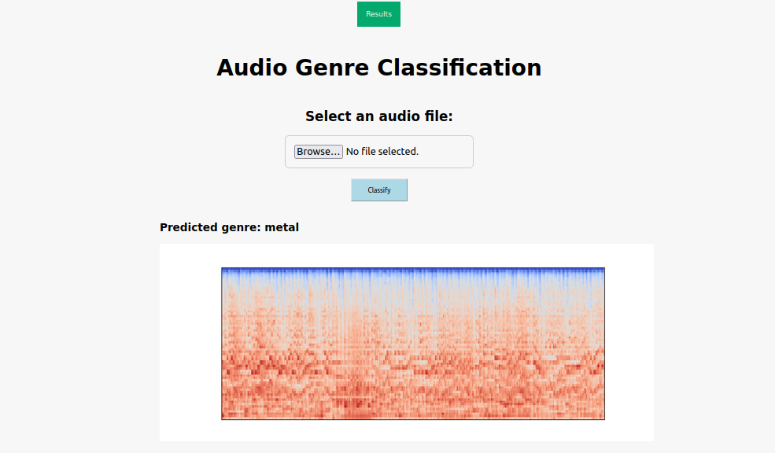

# Music-Genre-Classification

To install dependency run the following commands in the terminal.

    1. pip install -r requirements.txt
    
    2. pip install --upgrade -r requirements.txt

After sucussfully install all the requirements.

    Run webapp/app.py file to start the web server. 

  

